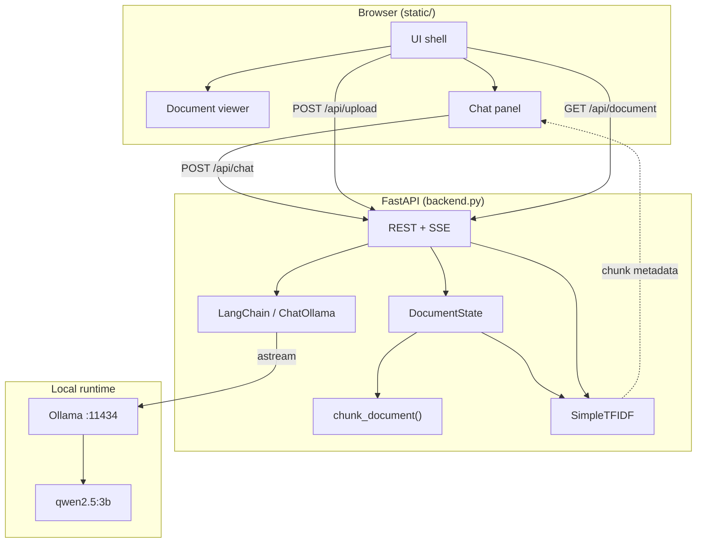
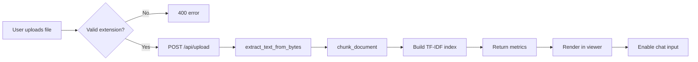
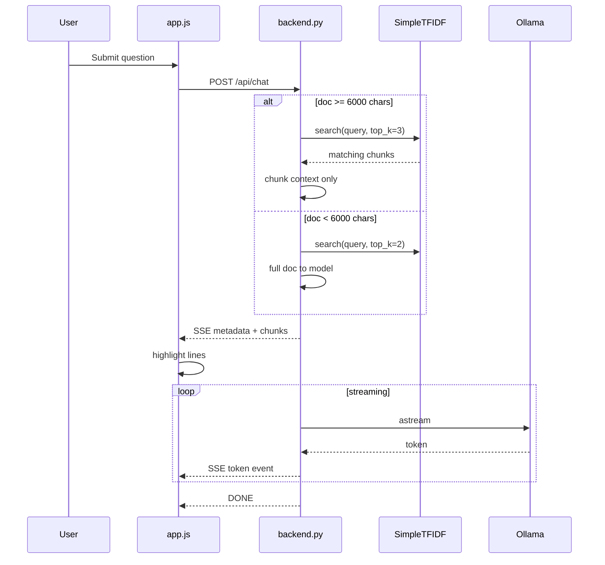
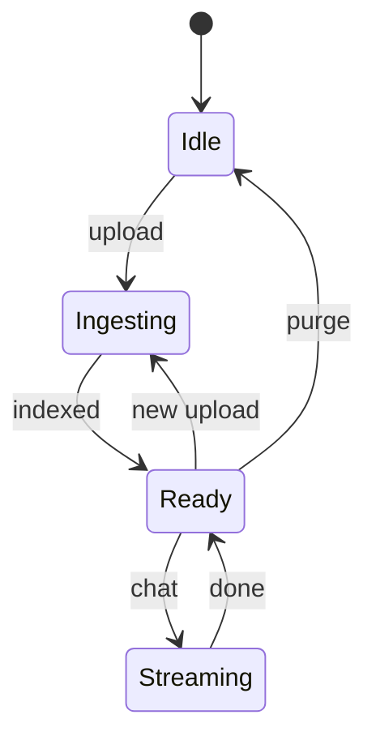
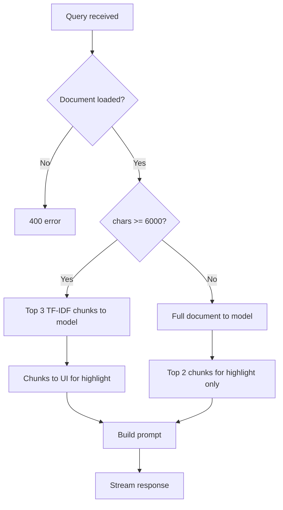
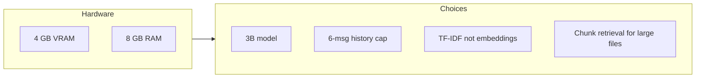
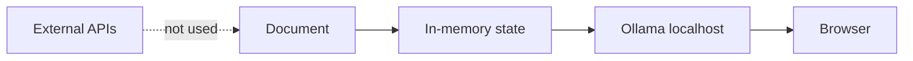

# Local-Cortex

Local document Q&A tool. Upload a file, ask questions, get answers grounded in the document with line-level citations. Inference runs through Ollama on your machine — no external API calls.

[](LICENSE)
[](https://www.python.org/)
[](https://fastapi.tiangolo.com/)

**Branch:** `user-interface` (current web UI)  
**Repo:** [Garvit-821/Local-ollama-powered-ai-assisted-doc-analyzer](https://github.com/Garvit-821/Local-ollama-powered-ai-assisted-doc-analyzer)

---

## Table of Contents

- [Overview](#overview)
- [Features](#features)
- [Architecture](#architecture)
- [Tech Stack](#tech-stack)
- [Project Structure](#project-structure)
- [Setup and Installation](#setup-and-installation)
- [Usage](#usage)
- [Configuration](#configuration)
- [API Reference](#api-reference)
- [Interface Versions](#interface-versions)
- [Hardware Notes](#hardware-notes)
- [Privacy](#privacy)
- [Roadmap](#roadmap)
- [Contributing](#contributing)
- [License](#license)

---

## Overview

Local-Cortex started as a command-line document chatbot and went through a Streamlit prototype before landing on the current FastAPI + vanilla JS setup. The web UI (`backend.py` + `static/`) is the version worth using.

The backend keeps one document in memory, chunks it, builds a TF-IDF index, and sends relevant sections to a local Ollama model (`qwen2.5:3b` by default). Responses stream back over SSE. The frontend highlights the source lines that were retrieved for each answer.

| | |
|---|---|
| Inference | Ollama on `localhost:11434` |
| Retrieval | Custom TF-IDF (no vector DB) |
| Target hardware | ~4 GB VRAM GPU, 8 GB RAM |
| Persistence | None — state clears on server restart |

---

## Features

| | What it does |
|---|---|
| File upload | `.txt`, `.md`, `.pdf`, `.docx` via drag-and-drop |
| Retrieval | TF-IDF search; large docs (6k+ chars) send top 3 chunks to the model |
| Chat | SSE token streaming |
| Citations | `Lines 15-28` badges; click to jump to those lines in the viewer |
| Follow-ups | Model appends two suggested questions per reply (parsed into buttons) |
| Search | Client-side filter over document lines |
| Session reset | "Purge Core Memory" clears document and chat history |

---

## Architecture

### System overview



### Upload flow



### Chat flow



### Session state



### Context selection



---

## Tech Stack

| Layer | Tool |
|-------|------|
| Backend | Python 3.10+, FastAPI, Uvicorn |
| LLM | Ollama + `qwen2.5:3b` |
| Orchestration | LangChain (`langchain-ollama`) |
| Retrieval | Custom TF-IDF (`math`, `re`, `collections`) |
| PDF | `pypdf` |
| DOCX | `python-docx` |
| Frontend | HTML, CSS, JS (no build step) |
| Fonts | Inter, JetBrains Mono (Google Fonts CDN) |

Older entry points still in the repo: `app.py` (CLI), `app_ui.py` (Streamlit).

---

## Project Structure

```
Local-ollama-powered-ai-assisted-doc-analyzer/
├── backend.py          # API, chunking, TF-IDF, SSE chat
├── static/
│   ├── index.html
│   ├── app.js
│   └── styles.css
├── DESIGN.md           # UI design tokens
├── app.py              # CLI version
├── app_ui.py           # Streamlit version
├── sample_doc.txt
├── test_sample.md
├── test_sample.docx
└── README.md
```

---

## Setup and Installation

### Requirements

| | Minimum | Recommended |
|---|---|---|
| Python | 3.10 | 3.12 |
| RAM | 8 GB | 16 GB |
| GPU | Not required | NVIDIA with 4 GB+ VRAM |
| Disk | ~3 GB free | For Ollama model + venv |
| OS | Linux, macOS, Windows 10/11 | |

You also need [Ollama](https://ollama.com) installed and running before chat will work. The web UI loads without it, but inference will fail until Ollama is up.

---

### Step 1 — Install Ollama

Pick your platform and run the commands below.

#### Linux (Ubuntu / Debian)

```bash
curl -fsSL https://ollama.com/install.sh | sh
```

#### macOS

```bash
curl -fsSL https://ollama.com/install.sh | sh
```

Or download the `.dmg` installer from https://ollama.com/download

#### Windows (PowerShell)

Download and run the installer from https://ollama.com/download

After install, open a new terminal and confirm Ollama is available:

```powershell
ollama --version
```

---

### Step 2 — Pull the default model

This downloads `qwen2.5:3b` (~2 GB). Run once.

```bash
ollama pull qwen2.5:3b
```

Verify it is listed:

```bash
ollama list
```

Start the Ollama service if it is not already running:

```bash
# Linux / macOS — usually starts automatically after install
ollama serve
```

On Windows, Ollama runs as a background app after installation. Check the system tray for the Ollama icon.

---

### Step 3 — Clone the repository

```bash
git clone https://github.com/Garvit-821/Local-ollama-powered-ai-assisted-doc-analyzer.git
cd Local-ollama-powered-ai-assisted-doc-analyzer
git checkout user-interface
```

---

### Step 4 — Create a virtual environment

#### Linux / macOS

```bash
python3 -m venv venv
source venv/bin/activate
```

#### Windows (PowerShell)

```powershell
python -m venv venv
.\venv\Scripts\Activate.ps1
```

#### Windows (Command Prompt)

```cmd
python -m venv venv
venv\Scripts\activate.bat
```

Your prompt should show `(venv)` when the environment is active.

---

### Step 5 — Install Python dependencies

Run this inside the activated virtual environment:

```bash
pip install --upgrade pip

pip install langchain-community langchain-ollama langchain-core fastapi uvicorn python-multipart python-docx pypdf
```

Optional — only if you want to run the older Streamlit UI (`app_ui.py`):

```bash
pip install streamlit
```

---

### Step 6 — Start the server

#### Linux / macOS

```bash
uvicorn backend:app --host 127.0.0.1 --port 8000 --reload
```

#### Windows (PowerShell or Command Prompt, with venv active)

```powershell
uvicorn backend:app --host 127.0.0.1 --port 8000 --reload
```

Alternative if `uvicorn` is not on PATH:

```bash
python -m uvicorn backend:app --host 127.0.0.1 --port 8000 --reload
```

You should see:

```
INFO:     Uvicorn running on http://127.0.0.1:8000
INFO:     Application startup complete.
```

---

### Step 7 — Open the app

Go to http://127.0.0.1:8000 in your browser.

Upload `sample_doc.txt` (included in the repo) to test. Ask something like: *"What is the daily calorie target?"*

---

### Full install script (copy-paste)

#### Linux / macOS

```bash
# Ollama
curl -fsSL https://ollama.com/install.sh | sh
ollama pull qwen2.5:3b

# Project
git clone https://github.com/Garvit-821/Local-ollama-powered-ai-assisted-doc-analyzer.git
cd Local-ollama-powered-ai-assisted-doc-analyzer
git checkout user-interface

python3 -m venv venv
source venv/bin/activate
pip install --upgrade pip
pip install langchain-community langchain-ollama langchain-core fastapi uvicorn python-multipart python-docx pypdf

# Run
uvicorn backend:app --host 127.0.0.1 --port 8000 --reload
```

#### Windows (PowerShell)

```powershell
# Ollama — install manually from https://ollama.com/download first, then:
ollama pull qwen2.5:3b

# Project
git clone https://github.com/Garvit-821/Local-ollama-powered-ai-assisted-doc-analyzer.git
cd Local-ollama-powered-ai-assisted-doc-analyzer
git checkout user-interface

python -m venv venv
.\venv\Scripts\Activate.ps1
pip install --upgrade pip
pip install langchain-community langchain-ollama langchain-core fastapi uvicorn python-multipart python-docx pypdf

# Run
uvicorn backend:app --host 127.0.0.1 --port 8000 --reload
```

---

### Verify everything is working

```bash
# Ollama API reachable
curl http://localhost:11434/api/tags

# App server reachable (in a second terminal)
curl http://127.0.0.1:8000/api/document
```

Expected: Ollama returns a JSON list of models. The app returns `{"status":"empty"}` before any file is uploaded.

---

### Troubleshooting

| Problem | Fix |
|---------|-----|
| `ollama: command not found` | Install Ollama from https://ollama.com and restart your terminal |
| `connection refused` in chat | Run `ollama serve` (Linux/macOS) or open the Ollama app (Windows) |
| `model not found` | Run `ollama pull qwen2.5:3b` |
| `uvicorn: command not found` | Use `python -m uvicorn backend:app --host 127.0.0.1 --port 8000 --reload` |
| Port 8000 already in use | Change port: `uvicorn backend:app --host 127.0.0.1 --port 8080 --reload` |
| PowerShell blocks venv activation | Run `Set-ExecutionPolicy -Scope CurrentUser RemoteSigned` once, then retry |
| PDF/DOCX upload fails | Confirm `pypdf` and `python-docx` are installed in the active venv |

---

### Running other versions

**CLI (terminal chatbot):**

```bash
python app.py
```

**Streamlit UI (requires `pip install streamlit`):**

```bash
streamlit run app_ui.py
```

---

## Usage

1. Upload a document when the modal opens (or use the upload button in the header).
2. The file appears in the left panel with line numbers.
3. Type a question in the chat panel on the right.
4. Relevant lines highlight as the answer streams in. Citation badges link back to those lines.
5. Click a suggested follow-up question to send it automatically.
6. Use "Purge Core Memory" to clear everything and upload a new file.

### Supported formats

| Format | Extension | How it's parsed |
|--------|-----------|-----------------|
| Plain text | `.txt` | UTF-8 decode |
| Markdown | `.md`, `.markdown` | UTF-8 decode |
| PDF | `.pdf` | `pypdf` |
| Word | `.docx` | `python-docx` |

### Example queries (`sample_doc.txt`)

| Question | What happens |
|----------|--------------|
| "What is the daily calorie target?" | Highlights early lines; answer cites 2400-2500 kcal |
| "What are vegetarian breakfast options?" | Pulls from the breakfast section |
| "Explain the Tuesday protocol" | Finds rule 2 under diet execution rules |

### Shortcuts

| Action | Key |
|--------|-----|
| Send | Enter |
| New line | Shift + Enter |

---

## Configuration

Values are hardcoded in `backend.py`:

| Setting | Default | Notes |
|---------|---------|-------|
| `model` | `qwen2.5:3b` | Change in `ChatOllama()` call |
| `temperature` | `0.3` | |
| `num_predict` | `512` | Max output tokens |
| Chunk size | `1000` chars | `chunk_document()` |
| Chunk overlap | `200` chars | |
| Large doc threshold | `6000` chars | Switches to chunk-only context |
| `top_k` (large) | `3` | Chunks to model |
| `top_k` (small, UI only) | `2` | Highlight only |
| History limit | `6` messages | |
| Host / port | `127.0.0.1:8000` | `uvicorn` args |

---

## API Reference

Base: `http://127.0.0.1:8000`

| Method | Path | Description |
|--------|------|-------------|
| GET | `/` | Web UI |
| GET | `/api/document` | Current document and metrics |
| POST | `/api/upload` | Upload file (multipart) |
| POST | `/api/chat` | Chat (SSE response) |
| POST | `/api/clear` | Reset session |

### Chat SSE events

```
data: {"type": "metadata", "chunks": [{"start_line": 1, "end_line": 13, "score": 0.85}]}

data: {"type": "token", "text": "The"}

data: {"type": "error", "detail": "..."}

data: [DONE]
```

### Upload response

```json
{
  "status": "success",
  "filename": "report.pdf",
  "metrics": {
    "chars": 12400,
    "words": 2100,
    "lines": 340,
    "chunks": 14
  }
}
```

---

## Interface Versions

| Version | File(s) | UI | Streaming | TF-IDF | Line citations |
|---------|---------|-----|-----------|--------|----------------|
| v1 | `app.py` | Terminal | No | No | No |
| v2 | `app_ui.py` | Streamlit | No | No | No |
| v3 | `backend.py`, `static/` | Web | Yes | Yes | Yes |

Use the `user-interface` branch for v3.

---

## Hardware Notes

Written with mid-range laptops in mind (e.g. RTX 3050 4 GB, 8 GB RAM):



- `qwen2.5:3b` fits in 4 GB VRAM through Ollama
- History capped at 6 messages to limit memory growth
- TF-IDF avoids loading a second embedding model
- Docs over 6k chars only send matching chunks to the model
- FastAPI avoids Streamlit's full-page rerun on every message

---

## Privacy



- No cloud LLM APIs
- Document lives in process memory until cleared or server stops
- No auth — intended for local use on `127.0.0.1`
- Single global session (not multi-user)
- Fonts/icons load from CDN on first visit; host them locally if you need full offline UI

This is a local dev tool, not something to expose on a public network as-is.

---

## Roadmap

- [ ] Embedding-based retrieval via Ollama (`nomic-embed-text`)
- [ ] Multiple documents per session
- [ ] Export chat history
- [ ] Model picker in the UI
- [ ] Docker setup
- [ ] Tests for chunking and TF-IDF
- [ ] Mobile layout

---

## Contributing

1. Fork the repo
2. Branch off `user-interface`: `git checkout -b your-change`
3. Make the change and test locally
4. Open a PR against `user-interface`

Keep PRs small and describe what you changed.

---

## Acknowledgments

- [Ollama](https://ollama.com) — local model runtime
- [LangChain](https://www.langchain.com/) — prompt/history handling
- [FastAPI](https://fastapi.tiangolo.com/)
- [Qwen2.5](https://huggingface.co/Qwen) — default model
- UI design tokens in `DESIGN.md` reference Wise's public design language

---

## License

MIT License

```
Copyright (c) 2026 Garvit Prakash

Permission is hereby granted, free of charge, to any person obtaining a copy
of this software and associated documentation files (the "Software"), to deal
in the Software without restriction, including without limitation the rights
to use, copy, modify, merge, publish, distribute, sublicense, and/or sell
copies of the Software, and to permit persons to whom the Software is
furnished to do so, subject to the following conditions:

The above copyright notice and this permission notice shall be included in all
copies or substantial portions of the Software.

THE SOFTWARE IS PROVIDED "AS IS", WITHOUT WARRANTY OF ANY KIND, EXPRESS OR
IMPLIED, INCLUDING BUT NOT LIMITED TO THE WARRANTIES OF MERCHANTABILITY,
FITNESS FOR A PARTICULAR PURPOSE AND NONINFRINGEMENT. IN NO EVENT SHALL THE
AUTHORS OR COPYRIGHT HOLDERS BE LIABLE FOR ANY CLAIM, DAMAGES OR OTHER
LIABILITY, WHETHER IN AN ACTION OF CONTRACT, TORT OR OTHERWISE, ARISING FROM,
OUT OF OR IN CONNECTION WITH THE SOFTWARE OR THE USE OR OTHER DEALINGS IN THE
SOFTWARE.
```

Issues: [GitHub Issues](https://github.com/Garvit-821/Local-ollama-powered-ai-assisted-doc-analyzer/issues)
